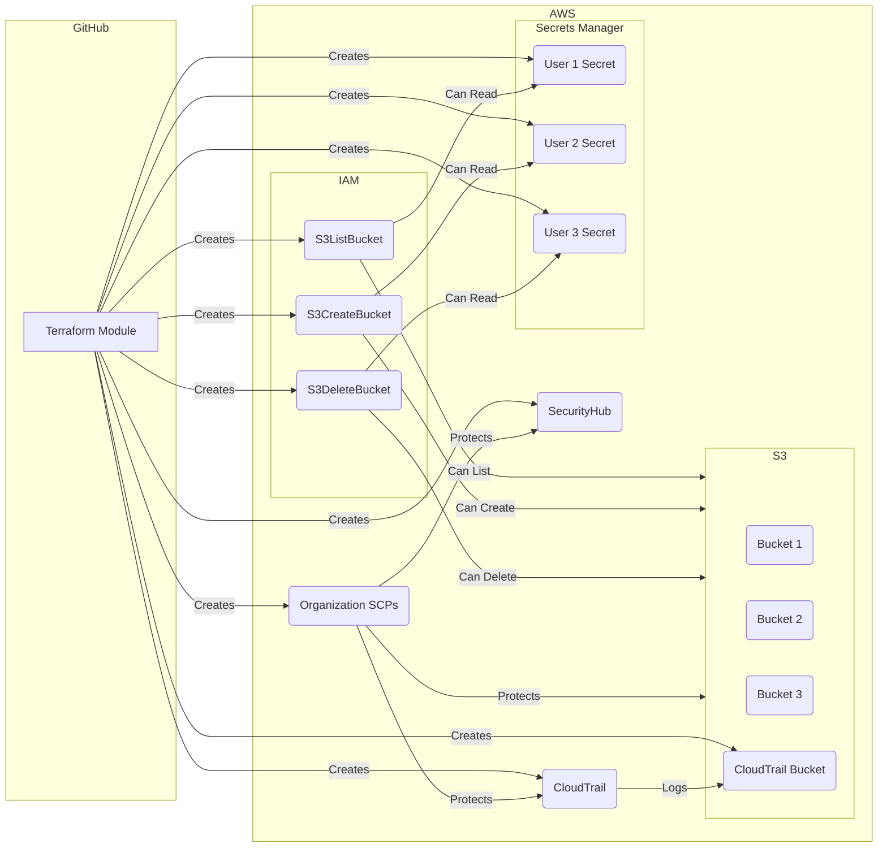

# Terraform-AWS

```mermaid
  graph LR;
      subgraph GitHub 
          Terraform[Terraform Module]
      end
      subgraph AWS
        subgraph Secrets Manager
          User1Secret(User 1 Secret)
          User2Secret(User 2 Secret)
          User3Secret(User 3 Secret)
        end
        subgraph IAM 
            User1(S3ListBucket)
            User2(S3CreateBucket)
            User3(S3DeleteBucket)
        end
        subgraph S3
            Bucket1(Bucket 1)
            Bucket2(Bucket 2)
            Bucket3(Bucket 3)
            CloudTrailBucket(CloudTrail Bucket)
        end
        
        CloudTrail(CloudTrail)
        
        SecurityHub(SecurityHub)
        
        Organization(Organization SCPs)
      end
      
      Terraform -- Creates --> User1 & User2 & User3 & User1Secret & User2Secret & User3Secret & SecurityHub & CloudTrail & CloudTrailBucket & Organization
      
      User1 -- Can Read --> User1Secret
      User2 -- Can Read --> User2Secret
      User3 -- Can Read --> User3Secret
      
      User1 -- Can List --> S3
      User2 -- Can Create --> S3
      User3 -- Can Delete --> S3
    
    CloudTrail -- Logs --> CloudTrailBucket
    
    Organization -- Protects --> SecurityHub & CloudTrail & S3
```
